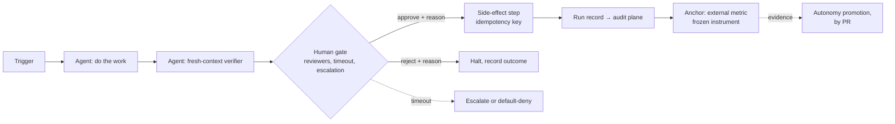

# What is graph engineering?

**Graph engineering is designing and operating AI-agent workflows as
explicit graphs, where the humans, budgets, and rules are nodes and
contracts in the graph, declared in versioned files, and enforced by
CI.**

Concretely, a graph-engineered workflow is defined by its artifacts:

- **Typed nodes**: agent steps, deterministic steps, and, first-class
  rather than bolted on, *human gates* with contracts (structured input,
  an approve/reject/modify + reason output, and explicit timeout
  behavior).
- **Edge contracts**: what flows between nodes, which resources each node
  may read or write, and idempotency keys on anything with side effects.
- **Versioned governance**: who owns the workflow, what identity it runs
  as, what it may spend, how it's stopped. All written down as files
  ([specs](../specs/TEMPLATE.md), [registries](../registry/agents.yaml),
  [anchor tables](../governance/anchors/TEMPLATE.md)) and reviewed like
  code.
- **CI enforcement**: a validator that fails the build when the paperwork
  is incoherent: an unregistered agent, a missing timeout, an owner
  approving their own output ([what CI enforces](../README.md#what-ci-enforces)).

If prompt engineering was about one model call and context engineering
about one agent's inputs, graph engineering is about the *system*: many
agents, many humans, over time, without anyone losing the ability to
answer "what is running, who owns it, how do I stop it, and what did it
actually do."

## The name, and its neighbors

Be aware of two things about the term. First, it is young and contested:
"graph engineering" broke out as a named discipline in **July 2026**
([field guide to the moment](https://theaioperator.io/p/what-is-graph-engineering-a-field)),
and immediately fragmented into three related meanings: (a) orchestration
graphs of typed nodes ([LangChain's usage](https://www.langchain.com/blog/3-years-of-graph-engineering-with-langgraph)),
(b) networks of feedback loops (evals, audits, policies) that watch and
correct each other, and (c) graph-structured knowledge and memory. This
repo spans (a) and (b): explicit workflow graphs, wrapped in measurement
and governance loops.

Second, the phrase has an older, unrelated meaning: **knowledge-graph /
graph-database engineering** (Neo4j, Cypher, GraphRAG). If you arrived
looking for that, this is not it. **No graph database is involved or
required here.** The graphs in this repo are workflow topologies, not
data models.

Practitioners reach the same discipline under other names, useful for
searching: *agent orchestration*, *agentic workflows*, *multi-agent
systems*, *[compound AI systems](https://www.ibm.com/think/topics/compound-ai-systems)*
(Berkeley, 2024), *durable execution*, *human-in-the-loop (HITL)
automation*, *AI agent governance*.

## The model in one diagram

Every element in that picture is a line in a versioned file: the gate's
reviewers and timeout are spec frontmatter, the agent is a registry entry
with an owner and a kill switch, the anchor is a row in the team's anchor
table, and the frozen instrument is a resource no optimizing agent may
write. The validator checks the whole picture stays coherent on every PR.

## The benefits, each anchored to a documented failure

The case for doing this is not tidiness; it is that agentic projects fail
in specific, measured ways, and each piece of the model treats one of
them. (Statistics dated; vendor-published numbers flagged.)

**1. Projects die from missing risk controls, not missing capability.**
Gartner predicts [over 40% of agentic AI projects will be canceled by
end-2027](https://www.gartner.com/en/newsroom/press-releases/2025-06-25-gartner-predicts-over-40-percent-of-agentic-ai-projects-will-be-canceled-by-end-of-2027)
(June 2025), citing escalating costs, unclear value, and *inadequate risk
controls*; MIT's NANDA project found [~95% of GenAI pilots produced no
measurable P&L impact](https://fortune.com/2025/08/18/mit-report-95-percent-generative-ai-pilots-at-companies-failing-cfo/)
(Aug 2025, methodology contested), attributing failure to adoption
mismanagement. Declared, CI-enforced governance is the treatment for
exactly those causes, and it's cheap when it's files in a repo.

**2. Human review capacity is the real constraint, and unmanaged gates
die quietly.** In the largest builder survey, [quality/trust is the #1
blocker and 59.8% still rely on human
review](https://www.langchain.com/state-of-agent-engineering) (LangChain,
Dec 2025). The arithmetic is unforgiving: 50 agents × 20 tool-calls/hour
with 10% routed to humans is [~100 approvals/hour, several FTEs doing
nothing but approving](https://hackernoon.com/the-oversight-fatigue-problem-why-hitl-breaks-down-at-scale-and-what-comes-after);
one documented team's approval rate hit [99.7% by day
three](https://aipatternbook.com/approval-fatigue): reviewers had stopped
reading, a failure mode known since
[Parasuraman & Riley's automation-complacency work
(1997)](https://jumpcloud.com/blog/the-dangerous-drop-in-human-oversight-of-autonomous-ai).
OWASP even catalogs [deliberately flooding human gates as an
attack](https://genai.owasp.org/resource/agentic-ai-threats-and-mitigations/).
That is why gates here have *contracts and budgets*: reviewers, timeouts,
escalation, and an [override-rate band with rubber-stamp
detection](../metrics/gate-health.md) that flags a dead gate instead of
letting it rot.

**3. Self-assessment is untrustworthy, so instruments must be frozen.**
METR's randomized trial found experienced developers were [19% *slower*
with early-2025 AI tools while believing they were 20%
faster](https://metr.org/blog/2025-07-10-early-2025-ai-experienced-os-dev-study/)
(July 2025; since labeled historical, and the perception gap is the
durable lesson). [DORA 2025](https://dora.dev/dora-report-2025/) finds AI
raises throughput *and* delivery instability, and amplifies existing team
dysfunction. Teams under pressure will honestly misperceive results and
dishonestly relax the measurement. That is why the instruments that
measure a workflow are [frozen](../registry/resources.yaml): no optimizing
agent, and no team being measured, holds write access. Non-waivable.

**4. Shadow agents are the default failure mode.** Security bodies and
IAM vendors converged on the same first artifact: an inventory of every
agent with an owner, scoped short-lived credentials, and a kill switch.
See the [OWASP Non-Human Identities Top
10](https://owasp.org/www-project-non-human-identities-top-10/) (2025)
and [Microsoft Entra Agent ID](https://learn.microsoft.com/en-us/entra/agent-id/)
(GA 2026), whose design (agents as first-class identities with no
standing credentials) is what [`registry/agents.yaml`](../registry/agents.yaml)
declares and CI enforces (`GE-CRED-STANDING`). Regulation points the same
way: [EU AI Act Article 14](https://artificialintelligenceact.eu/article/14/)
requires oversight with the ability to interrupt to a safe state, which
means a [kill switch](runbooks/kill-switch.md) with named holders.

**5. Autonomy can be *earned* instead of argued about.** The consensus
pattern in 2026 guidance (oversight tiered by risk and reversibility,
sampled review at higher tiers, promotion only on recorded evidence:
[CSA autonomy levels](https://cloudsecurityalliance.org/blog/2026/01/28/levels-of-autonomy),
Jan 2026) is exactly this repo's rule that [autonomy scales with
external anchors, never internal metrics](../governance/decision-rights.md),
with the paper trail in the spec's promotion history. See the
[three reference specs](../specs/example-team/), which are the ladder's
three live rungs.

**6. The audit trail is a by-product, not a project.** Every run leaves a
[run record](../schemas/run-record.schema.json) and every gate a
[decision with a reason](../schemas/gate-decision.schema.json), which is
most of what [auditors and regulators ask
for](../governance/compliance-mapping.md), produced by the workflow's
normal operation. For small firms this matters too: only
[31% feel prepared for AI rules requiring disclosure, risk assessment,
and human oversight](https://www.uschamber.com/technology/empowering-small-business-the-impact-of-technology-on-u-s-small-business)
(US Chamber, Aug 2025); a versioned registry with a PR trail *is* that
preparation.

## What this repo adds

Every major framework now ships an interrupt/approval primitive:
LangGraph `interrupt()`, Temporal signals, Step Functions
`waitForTaskToken`, Microsoft Agent Framework checkpoints, OpenAI Agents
SDK approvals, Claude Agent SDK hooks
([crosswalk](implementation-examples.md)). What none of them ship is the
layer above: **governance as versioned files, enforced by CI**. In
effect, *a linter for your agent fleet's governance*, positioned the way
OPA/Conftest is for infrastructure. That approach has independent
precedent: GitHub's [Minimum Viable
Governance](https://github.com/github/MVG) (governance as Markdown you
copy into your org) and FINOS's
[Governance-as-Code](https://ai.finos.org/governance-as-code/) stream
(machine-readable AI policies validated in CI/CD). This repo is that
idea, built out for agent workflows: the spec is the contract, your
runtime is an implementation detail, and the validator is the enforcement
point.

## Honest limits

- **This is a ≥2-person framework.** Separation of duties is non-waivable:
  a solo operator cannot review their own gates and shouldn't pretend to
  (see [the small-team path](paths/small-team.md) for what *is* honest at
  each size).
- **Review is a real cost.** The "verification tax" is documented
  ([30% of developers report little or no trust in AI
  code](https://dora.dev/dora-report-2025/)); gates convert that tax from
  ambient anxiety into a budgeted, measured line item; they don't remove
  it.
- **Comprehension debt is real.** Merging changes no human can explain is
  a documented failure mode of agent-heavy teams; the gate contract's
  *reason* field, and a reviewer who can walk through the change, are the
  guard, not a guarantee.
- **The rules are only as strong as the platform.** Without branch
  protection and a required `validate` check
  ([platform hardening](platform-hardening.md)), everything here is
  advisory.

*Next:* [try it in about an hour](tutorial-first-workflow.md), or go
straight to [the path for your size](paths/small-team.md)
([enterprise](paths/enterprise.md)).
