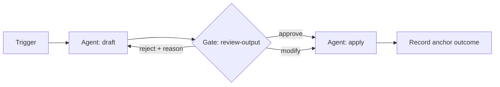

---
# GRAPH SPEC — copy this file into specs/<team>/<name>.md and fill in every field.
# Frontmatter is machine-validated by scripts/validate.py (run in CI on every PR).
# Delete the comments when you're done; keep the keys.
spec: graph/v1
name: my-workflow-name                # kebab-case, unique across specs/
status: draft                         # draft | pilot | promoted | deprecated | killed
team: my-team
owner: github-handle                  # the Workflow DRI. Exactly one. Lowercase —
                                      # handles are compared case-insensitively and
                                      # the schema rejects mixed case.
backup_owner: github-handle           # covers the owner's absence. Not the owner,
                                      # and (like the owner) never a reviewer or
                                      # escalation target on this spec's gates.
created: 2026-08-20
review_by: 2026-11-20                 # quarterly. A past date marks the spec orphaned and fails CI.

shape: personal                       # personal | shared. "shared" only for workflows that
                                      # genuinely cross ownership boundaries; justify below.

runtime: ticket                       # ticket | langgraph | temporal | claude-workflow
                                      # Start with "ticket" unless you can state why it failed.

agents:                               # every agent identity this graph runs under.
  - my-team-workflow-bot              # must exist in registry/agents.yaml (active, owned,
                                      # kill-switchable). No shared credentials, no human
                                      # impersonation.

autonomy:
  anchor_class: internal              # external | internal. "external" requires anchors below
                                      # and unlocks sampling oversight; "internal" means tight
                                      # gates regardless of architecture.
  anchors: []                         # anchor ids from the team's machine-readable anchor
                                      # table (governance/anchors/<team>.yaml), e.g.
                                      # [cash-collected, churn-30d]. Required if anchor_class
                                      # is external; CI rejects ids the table doesn't define.
  oversight: full-gating              # full-gating | sampling. sampling requires
                                      # anchor_class: external AND 4 weeks of gate metrics
                                      # (see governance/decision-rights.md).
  sampling_rate: null                 # e.g. 0.10 — required when oversight is sampling.

cost:
  cap_per_run_usd: 5                  # hard cap; the runtime must stop the run at this spend.
  alert_threshold_usd: 3              # anomaly alert to the owner before the cap is hit.
  # cap_per_day_usd: 25               # optional aggregate ceiling — bounds many runs each
                                      # under cap (cron storms, retry loops). Must be >= the
                                      # per-run cap.

resources:                            # every shared resource this graph touches. ids must
  reads: []                           #   exist in registry/resources.yaml.
  writes: []                          # writes to a frozen resource fail CI (measurement
                                      #   instruments are frozen). Two active specs writing
                                      #   the same resource are flagged as contention.

gates:                                # every human node. At least one unless status is draft.
  - id: review-output
    class: quality                    # irreversible | external | quality
                                      #   irreversible/external (payments, sends, publishes,
                                      #   prod changes) must keep 100% gating even under
                                      #   sampling oversight.
    surface: ticket                   # pr | chat | ticket
    reviewers: [github-handle]        # who may resolve this gate. The spec owner is
                                      #   excluded (separation of duties, non-waivable);
                                      #   the backup owner too (waivable by exception for
                                      #   small teams). Listing either fails CI.
    timeout_hours: 24
    on_timeout: escalate              # escalate | default_deny | reroute
    escalate_to: github-handle        # required when on_timeout is escalate. Not the
                                      #   owner/backup, and not already a reviewer on
                                      #   this gate — escalation needs a fresh person.

pathology_guards:
  max_debate_rounds: 3                # cap on any agent-debate pattern
  max_agent_group: 4                  # ceiling on concurrent agents in one judgment
  fresh_context_verifier: true        # mandatory on judgment nodes
  arbitration_default: reject         # what happens on non-convergence

kill_switch:
  how: "Disable the agent identity in registry/agents.yaml and revoke its credentials"
  authorized: [security-owner, owner] # no approval needed to stop; approval needed to restart
---

# <Workflow name>

## Objective

What this graph optimizes, in one paragraph. Reference the team's anchor table
(`governance/anchors/<team>.md`) for how success is verified externally.

## Why this shape

If `shape: shared`, state the ownership boundaries this workflow genuinely
crosses and why personal graphs with output contracts can't serve it. If
`shape: personal`, delete this section.

## Graph

Describe the nodes and edges. A Mermaid diagram is encouraged:

For every node with side effects, state its idempotency key — derived from
`(run_id, step_id)` — and what a safe retry looks like.

## Human node contracts

For each gate in the frontmatter, describe:

- **Input**: the artifact plus the minimum context needed to judge it. Never
  the worker agent's full chat transcript.
- **Output**: `approve | reject | modify` + reason (see
  `schemas/gate-decision.schema.json`). Free-text "LGTM" is not a resolution.
- **Timeout behavior**: matches the frontmatter; name the backup.

## Audit

Where run records land (see `schemas/run-record.schema.json`) and who reviews
gate-health metrics for this workflow.

## Promotion history

| Date | Change | Evidence |
|------|--------|----------|
| YYYY-MM-DD | Created as draft | — |
