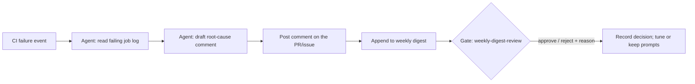

# CI failure explainer

The third reference spec, and deliberately the smallest: the **suggest-only
bottom rung** of the autonomy ladder. `weekly-release-review` acts behind a
gate on every run (L2); `dependency-update-triage` has earned sampled
oversight (L3); this one only *comments* (L1). It exists to be the copy-me
for a team's first spec; every field is the smallest value the validator
accepts, and the tutorial (`docs/tutorial-first-workflow.md`) walks through
it line by line.

## Objective

When a CI run on the main repository fails, read the failing job's log,
and post one comment on the associated PR or issue: the probable root
cause, the first failing step, and whether the failure looks related to
the change. Humans still do every fix; the agent only saves the
twenty-minute log spelunk. Suggest-only is the point: the blast radius of
a wrong comment is one misleading paragraph, visible only internally.

## Graph

Side-effect nodes and idempotency:

- **Post comment**: idempotency key `(run_id, post-comment)`; a retry
  edits the existing comment for that run rather than posting a duplicate.

## Human node contracts

- **weekly-digest-review**: the gate is a **batch**, not a per-comment
  approval. Gating every comment before it posts would cost more reviewer
  time than the log-reading it saves; a gate whose cost exceeds its
  value gets rubber-stamped within weeks (`metrics/gate-health.md`).
  Instead: comments post immediately, and once a week bob receives one
  ticket containing every comment the bot made, with the linked CI runs.
  Input: the digest plus links. Output: approve / reject / modify + reason
  per `schemas/gate-decision.schema.json`. A reject means the bot's
  analyses are misleading and its prompts get fixed (or the spec gets
  killed) before it comments again. Timeout: 48h then default-deny, which
  here means the bot **pauses commenting** until the digest is reviewed,
  the safe direction for a suggest-only graph, and the three-person
  pattern that needs no escalation target.

Separation math: dana owns, alice is backup, bob reviews. That's the
minimum three people, none wearing two hats on this spec (see
`docs/paths/small-team.md` for the 1/2/3/4-person table).

## Audit

Each CI-failure run appends one line to the week's parent issue; the
digest gate's decision is recorded on it per
`schemas/gate-decision.schema.json`, and the week's run record
(`schemas/run-record.schema.json`) closes it. Override rate reviewed
monthly by dana. For a suggest-only graph, ~0% override for weeks means
the digest gate is theater: consider whether it has earned a lighter
cadence, by PR.

## Promotion history

| Date | Change | Evidence |
|------|--------|----------|
| 2026-08-20 | Created as pilot reference spec (L1 rung) | none |
