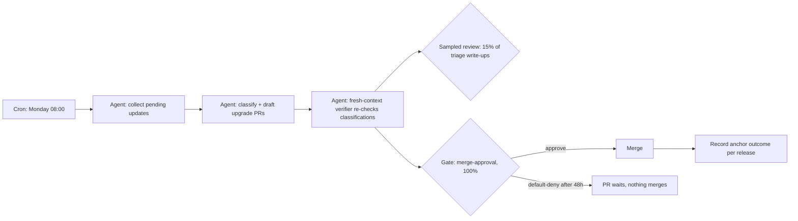

# Dependency update triage

The second reference spec, deliberately contrasting with
`weekly-release-review.md`. That one is a **shared** graph under
**full gating** (its go/no-go is externally visible, so every run gets a
human). This one is a **personal** graph that has *earned* **sampling
oversight**: its outcomes are measured by an external anchor, so humans
review a random 15% of its triage write-ups — while the genuinely
irreversible step (merging to main) keeps a 100% gate regardless.
That split — sample the judgment, always gate the irreversible — is the
plan's autonomy model in one file.

## Objective

Weekly, triage incoming dependency updates: classify each as low-risk
(patch bumps with passing CI and no API surface change) or needs-attention,
draft upgrade PRs for the low-risk set, and write a one-paragraph risk note
for the rest. Verified externally by the regression rate attributed to
dependency changes in frozen release telemetry
(`governance/anchors/example-team.yaml`).

## Why sampling is justified here (the paper trail)

Promotion history below records what `governance/decision-rights.md`
requires for an autonomy increase: four weeks of gate metrics with the
override rate in band, plus anchor coverage. If
`dependency-regression-rate` degrades, the first response is reverting this
spec to `oversight: full-gating` by PR — cheap, reviewable, and exactly
what the spec format is for.

## Graph

Side-effect nodes and idempotency:

- **draft upgrade PRs** — idempotency key `(run_id, draft-pr-<dep>)`; a
  retry updates the existing branch/PR for that dependency rather than
  opening a duplicate.

## Human node contracts

- **merge-approval** — Input: the upgrade PR diff plus the bot's risk note.
  Output: PR review mapped to approve/reject/modify. Reviewer: alice;
  timeout 48h then default-deny — an unreviewed upgrade simply doesn't
  merge, which is the safe direction for an irreversible action.
- **Sampled review** — 15% of triage write-ups, routed as a ticket to the
  week's sampler (rotates between alice and dana). Outputs feed the
  override-rate metric like any gate decision.

Separation math: bob owns, carol is backup, so alice holds the merge gate
and alice/dana take samples — neither owner nor backup reviews anything.

## Audit

Run records attach to the weekly parent issue; anchor outcomes land per
release from the frozen telemetry. Sampling decisions are recorded
identically to full-gate decisions (`schemas/gate-decision.schema.json`) so
override-rate is computable across both oversight modes.

## Promotion history

| Date | Change | Evidence |
|------|--------|----------|
| 2026-05-10 | Created as draft | — |
| 2026-06-01 | draft → pilot | First anchor table entry; full gating |
| 2026-07-15 | pilot → promoted, sampling 15% approved | 4 weeks gate metrics: median latency 9h, override rate 12%, anchor flat; approved per decision-rights |
