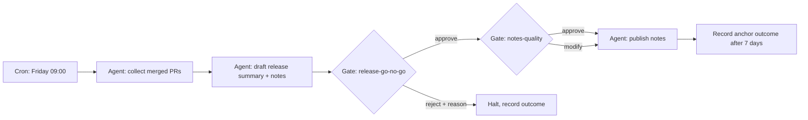

# Weekly release review

This is the reference pilot spec (see `docs/plan.md`, "Pilot specification").
It exists so the repo always contains one spec that passes every validation
rule; replace it with your own pilot when you run one.

## Objective

Assemble the weekly release candidate summary, verify release health against
frozen telemetry, and publish release notes, with a human go/no-go gate
before anything externally visible happens. Verified externally by
customer-found incidents and rollback rate (see
`governance/anchors/example-team.md`).

## Why this shape

Release management genuinely crosses ownership boundaries: engineering owns
the changes, support owns the customer-facing notes, and the on-call owner
holds the go/no-go. No single personal graph can contract for all three.

## Graph

Side-effect nodes and idempotency:

- **publish notes**: idempotency key `(run_id, publish-notes)`; publishing is
  an upsert keyed on the release tag, so a retry overwrites the same page
  rather than creating a duplicate.

## Human node contracts

- **release-go-no-go**: Input: the release summary artifact (changes, risk
  callouts, current telemetry snapshot). Output: structured
  approve/reject/modify + reason. Reviewer: bob; timeout 24h then escalate
  to carol. Resolved as a child issue on the run's parent issue.
- **notes-quality**: Input: the draft notes as a PR diff against the notes
  page. Output: PR review mapped to approve/reject/modify. Reviewer: carol;
  timeout 48h then default-deny (notes ship the following week instead).

Note the separation math for a four-person team: alice owns, dana is backup,
so bob and carol hold the gates; neither the owner nor the backup reviews
anything this graph produces (CI enforces both; the backup rule is waivable
by exception for smaller teams, the owner rule is not).

## Audit

Each run is a parent issue; gate resolutions are child issues. The run record
(`schemas/run-record.schema.json`) is attached to the parent issue on
completion. Gate-health metrics reviewed weekly by the owner against
`metrics/gate-health.md`.

## Promotion history

| Date | Change | Evidence |
|------|--------|----------|
| 2026-08-20 | Created as pilot reference spec | none |
